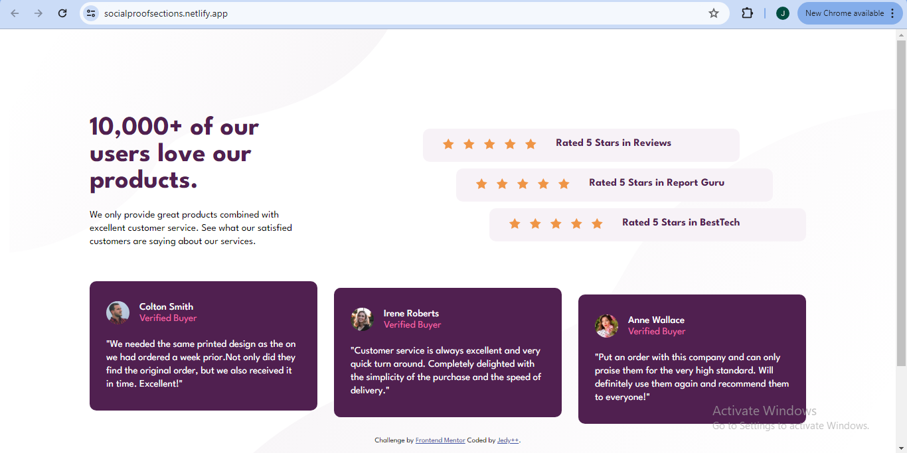

# Frontend Mentor - Social proof section solution

This is a solution to the [Social proof section challenge on Frontend Mentor](https://www.frontendmentor.io/challenges/social-proof-section-6e0qTv_bA). Frontend Mentor challenges help you improve your coding skills by building realistic projects. 

## Table of contents

- [Overview](#overview)
  - [The challenge](#the-challenge)
  - [Screenshot](#screenshot)
  - [Links](#links)
- [My process](#my-process)
  - [Built with](#built-with)
  - [What I learned](#what-i-learned)
- [Author](#author)

**Note: Delete this note and update the table of contents based on what sections you keep.**

## Overview

### The challenge

Users should be able to:

- View the optimal layout for the section depending on their device's screen size

### Screenshot

 

### Links

- Solution URL: [check out my solution](https://www.frontendmentor.io/solutions/responsive-social-proof-section-grid-and-flexbox-O2HdKVm5i1)
- Live Site URL: [social proof section](https://your-live-site-url.com)

## My process

### Built with

- Semantic HTML5 markup
- CSS custom properties
- Flexbox
- CSS Grid
- Mobile-first workflow
- [Styled Components](https://styled-components.com/) - For styles

### What I learned

I learned a lot in positioning elements and responsiveness. This is one my most challenging project so far.

## Author

- Website - [Jedy++](https://github.com/Jedyokey)
- Frontend Mentor - [@Jedyokey](https://www.frontendmentor.io/profile/Jedyokey)
